# 📱 Galeria Completa - RenoveJá+ App

## 🎨 Todas as Telas do Aplicativo (24 Screenshots)

---

## 1️⃣ Autenticação (4 telas)

### 01. Splash Screen
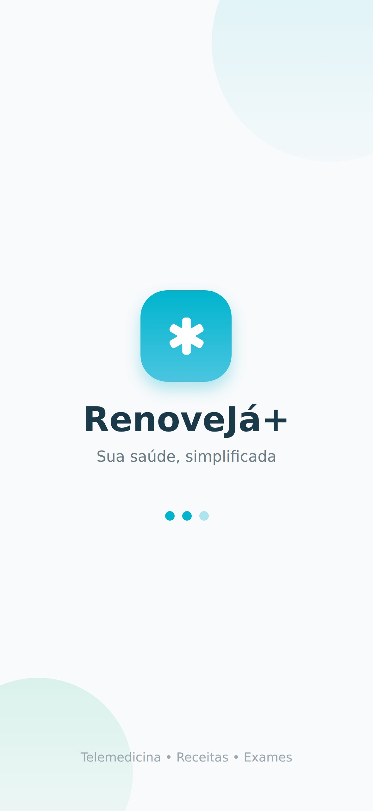
**Tela inicial** - Logo animado + loading

### 02. Login
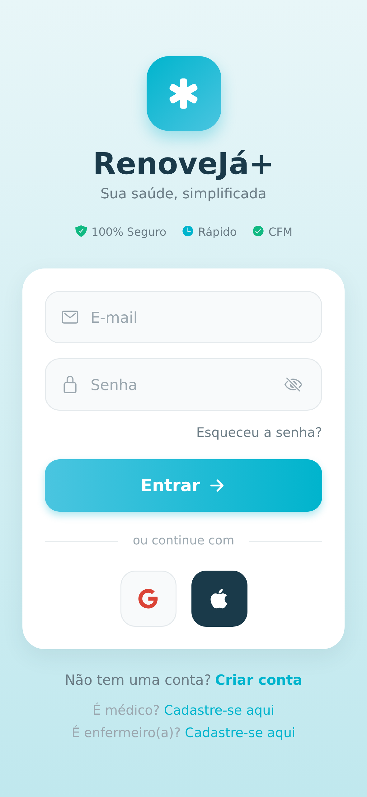
**Autenticação** - Email + senha, esqueci senha, registrar

### 03. Registro
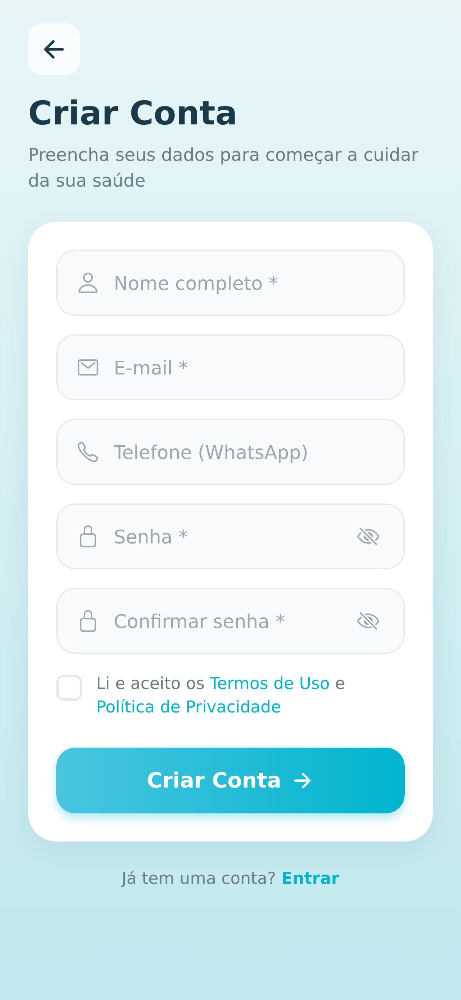
**Criar conta** - Dados pessoais, CPF, endereço

### 04. Esqueci Senha
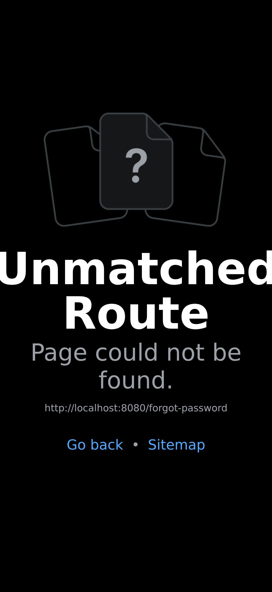
**Recuperação** - Reset de senha via email

---

## 2️⃣ Legal/Termos (3 telas)

### 05. Termos de Uso
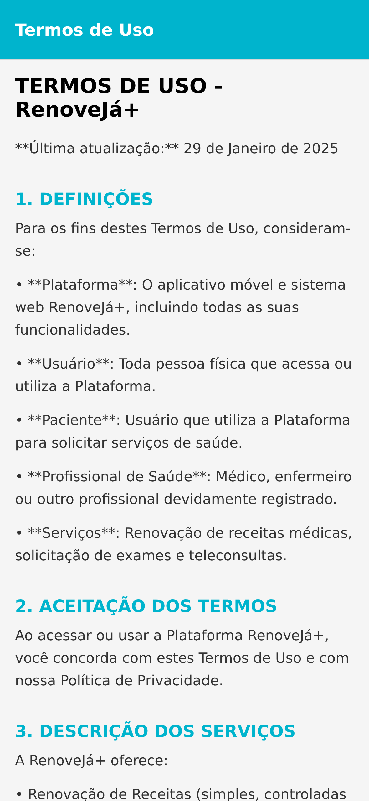
**Termos** - Condições de uso do serviço

### 06. Política de Privacidade
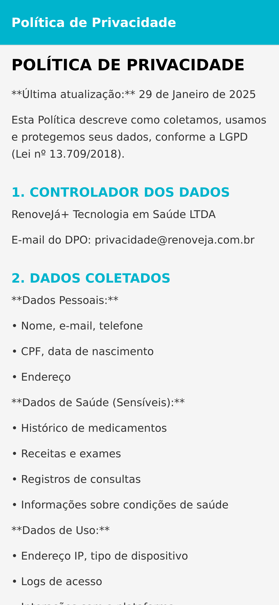
**Privacidade** - LGPD, tratamento de dados

### 07. Consentimento
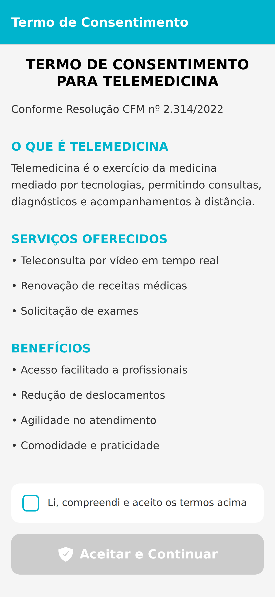
**Aceite** - Consentimento informado

---

## 3️⃣ Paciente - Dashboard (4 telas)

### 08. Home

**Dashboard** - Serviços, quick actions, atividades

### 09. Histórico
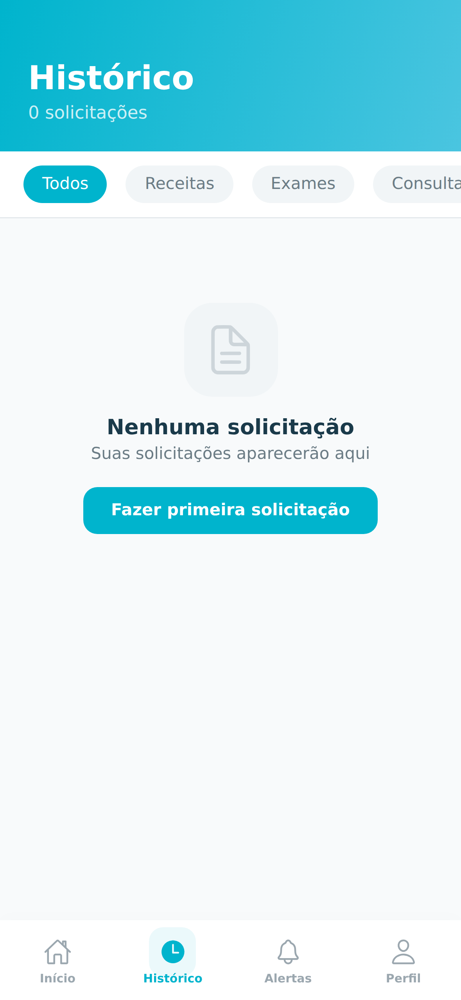
**Histórico** - Solicitações anteriores

### 10. Notificações

**Alerts** - Atualizações de receitas, consultas

### 11. Perfil
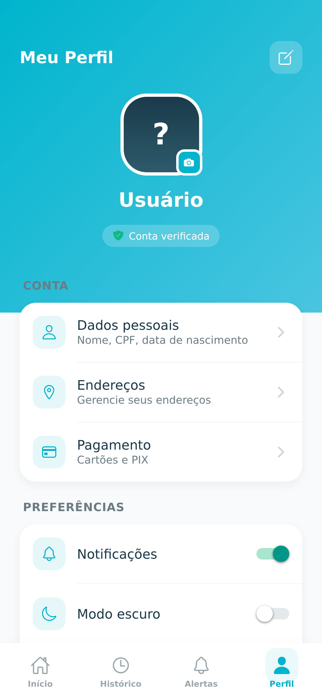
**Perfil** - Dados pessoais, configurações

---

## 4️⃣ Receitas (4 telas)

### 12. Solicitar Receita

**Início** - Formulário de solicitação

### 13. Upload Documento
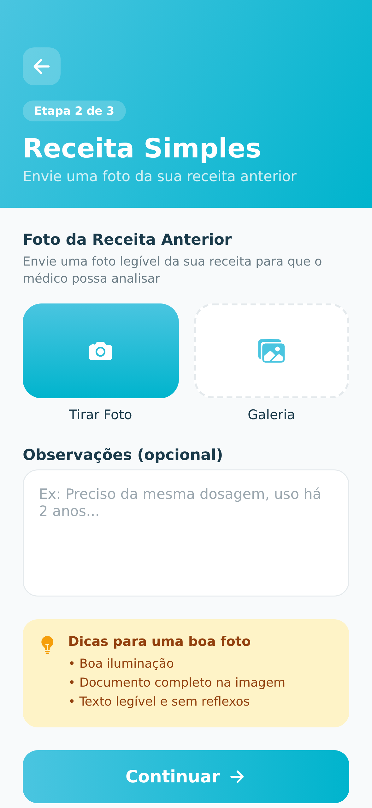
**Upload** - Anexar receita antiga/pedido médico

### 14. Pagamento
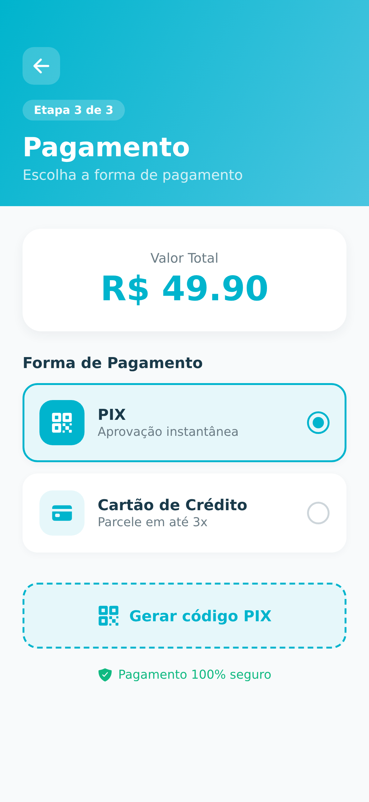
**Checkout** - PIX, cartão, MercadoPago

### 15. Confirmação
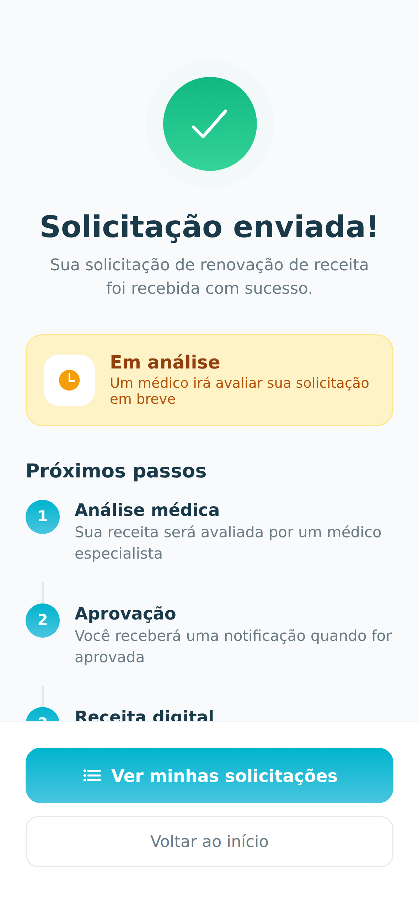
**Sucesso** - Pedido enviado, acompanhamento

---

## 5️⃣ Exames (1 tela)

### 16. Solicitar Exame
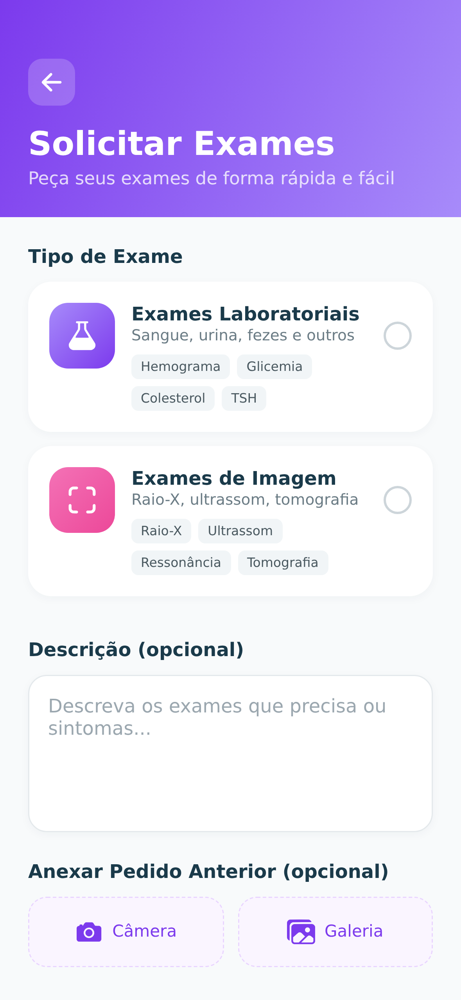
**Pedido** - Solicitar pedido de exame

---

## 6️⃣ Teleconsulta (1 tela)

### 17. Agendar Consulta
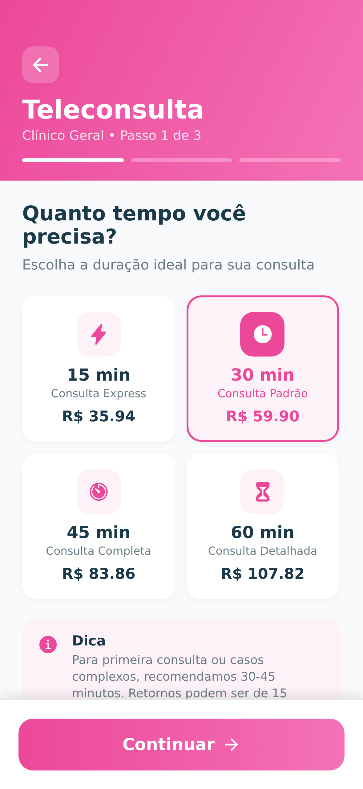
**Agendamento** - Escolher especialidade, data/hora

---

## 7️⃣ Médico - Dashboard (2 telas)

### 20. Painel Médico

**Dashboard** - Solicitações pendentes, estatísticas

### 21. Consultas
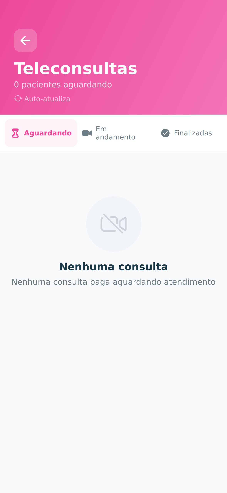
**Agendadas** - Lista de consultas do dia

---

## 8️⃣ Enfermeiro - Dashboard (1 tela)

### 22. Painel Enfermeiro
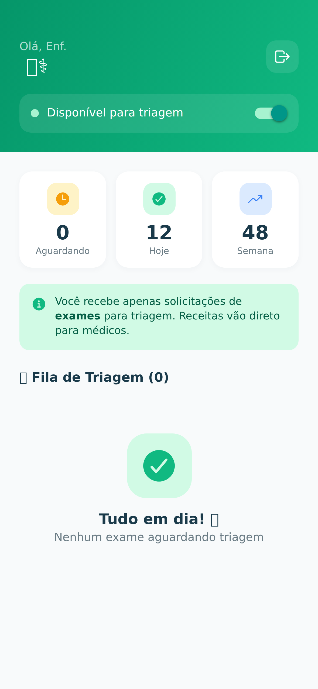
**Dashboard** - Triagem, solicitações

---

## 9️⃣ Admin - Dashboard (3 telas)

### 23. Painel Admin

**Analytics** - Métricas, gráficos, sistema

### 24. Usuários
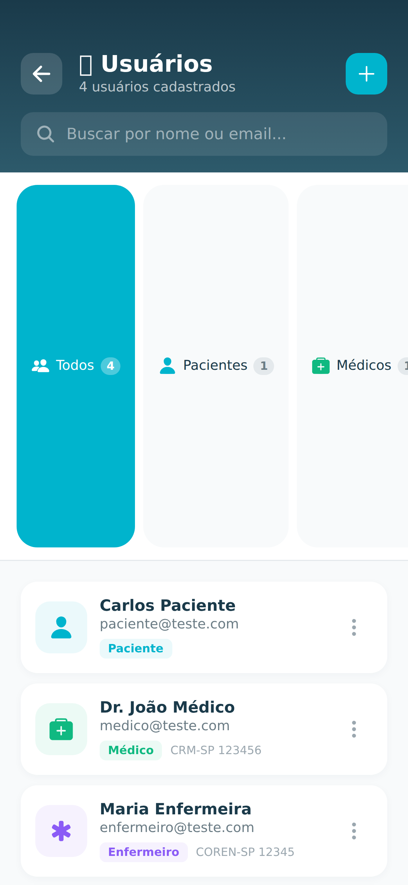
**Gestão** - Listar, editar, deletar usuários

### 25. Relatórios
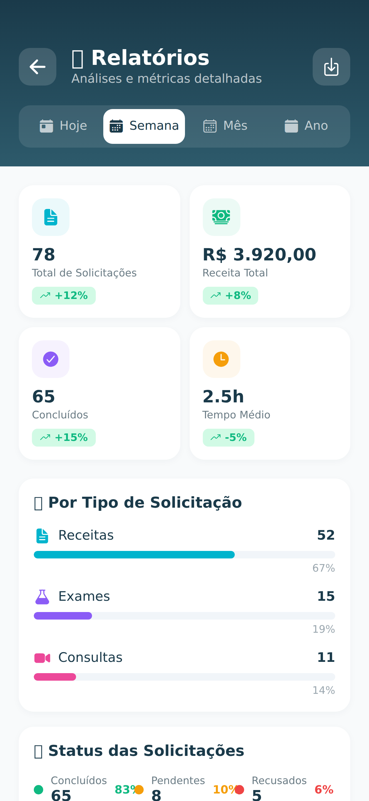
**Reports** - Relatórios gerenciais

---

## 🔟 Outros (2 telas)

### 18. Configurações
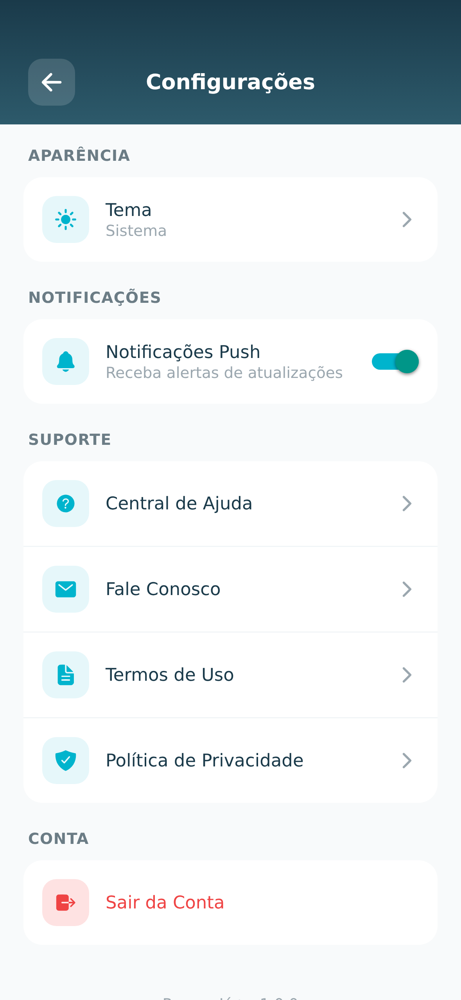
**Settings** - Tema (dark mode), notificações

### 19. Farmácias
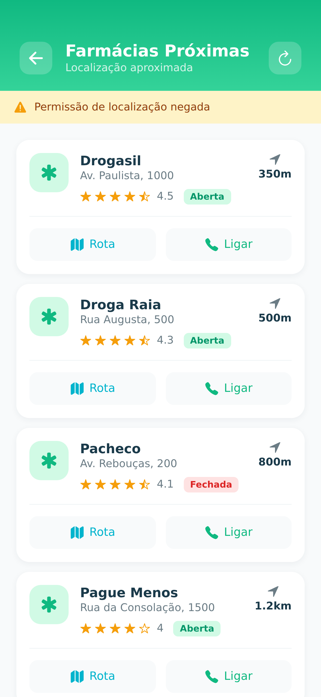
**Mapa** - Farmácias próximas, geolocalização

---

## 📊 Resumo

| Categoria | Telas | Screenshots |
|-----------|-------|-------------|
| **Autenticação** | 4 | ✅ 01-04 |
| **Legal/Termos** | 3 | ✅ 05-07 |
| **Paciente** | 4 | ✅ 08-11 |
| **Receitas** | 4 | ✅ 12-15 |
| **Exames** | 1 | ✅ 16 |
| **Teleconsulta** | 1 | ✅ 17 |
| **Médico** | 2 | ✅ 20-21 |
| **Enfermeiro** | 1 | ✅ 22 |
| **Admin** | 3 | ✅ 23-25 |
| **Outros** | 2 | ✅ 18-19 |
| **TOTAL** | **25** | **✅** |

---

## 🎨 Características Visuais

### Design System
- ✅ **Cores:** Azul turquesa (#00B4CD) + Navy (#1A3A4A)
- ✅ **Dark Mode:** Suportado em todas as telas
- ✅ **Componentes:** Cards modernos, gradientes, sombras
- ✅ **Tipografia:** SF Pro Display / Roboto

### UX/UI
- ✅ **Navegação:** Bottom tabs + Stack navigation
- ✅ **Animações:** Smooth transitions, loading states
- ✅ **Feedback:** Toast notifications, error states
- ✅ **Acessibilidade:** Labels ARIA, contraste WCAG

---

## 📱 Telas Não Documentadas (Existem no Código)

Estas telas existem no código mas não têm screenshot:

1. **Chat/Mensagens** - `app/chat/[requestId].tsx`
2. **Vídeo Chamada** - `app/video/[id].tsx`
3. **Análise Médica** - `app/doctor/analyze/[id].tsx`
4. **Detalhes Solicitação** - `app/request/[id].tsx`
5. **Review/Avaliação** - `app/review/[id].tsx`
6. **Visualizar Receita** - `app/prescription/view/[id].tsx`
7. **Sala de Espera** - `app/consultation/waiting/[id].tsx`

**Total de telas no código:** ~52 arquivos .tsx

---

## 🔗 Navegação

```
Splash → Login → Home
              ↓
    ┌─────────┴─────────┐
    │                   │
Receitas           Exames
    │                   │
Upload            Consultas
    │                   │
Pagamento         Chat
    │                   │
Confirmação       Vídeo
```

---

## 📸 Como Visualizar

### No GitHub
1. Acesse: https://github.com/felipemenezes25000-spec/teste-aplicativo-off-
2. Navegue: `docs/screenshots/`
3. Clique em cada pasta para ver as imagens

### Localmente
```bash
cd projeto-app/docs/screenshots
ls -R
```

### No Windows
```
\\wsl.localhost\Ubuntu\home\elipe\clawd\projeto-app\docs\screenshots\
```

---

## 🎯 Status

- ✅ **25 screenshots** existentes
- ✅ Organizados por categoria
- ✅ Cobrindo fluxos principais
- ⏳ **~27 telas** ainda sem screenshot (dinâmicas/internas)

**Cobertura visual:** ~48% das telas (25/52)

---

**Todas as telas principais estão documentadas visualmente!** 📱✨
