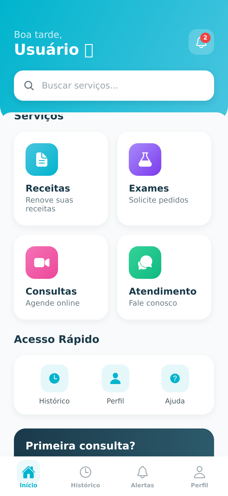
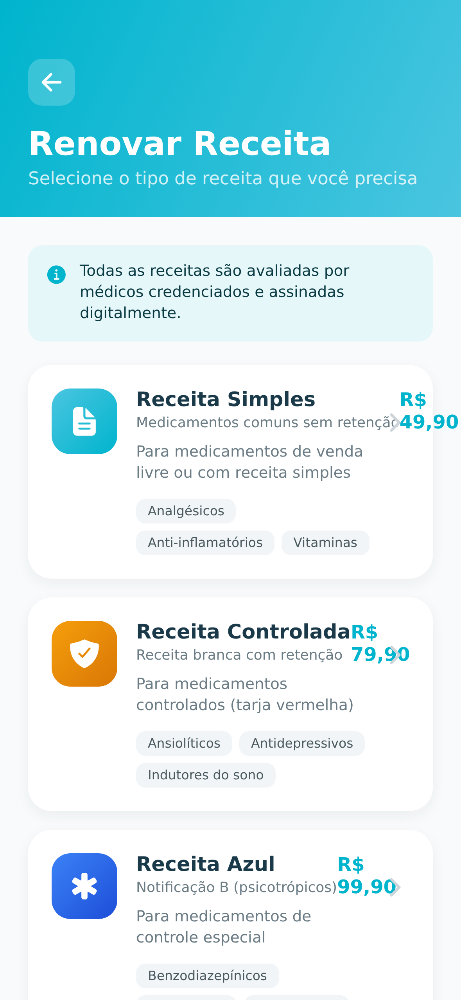
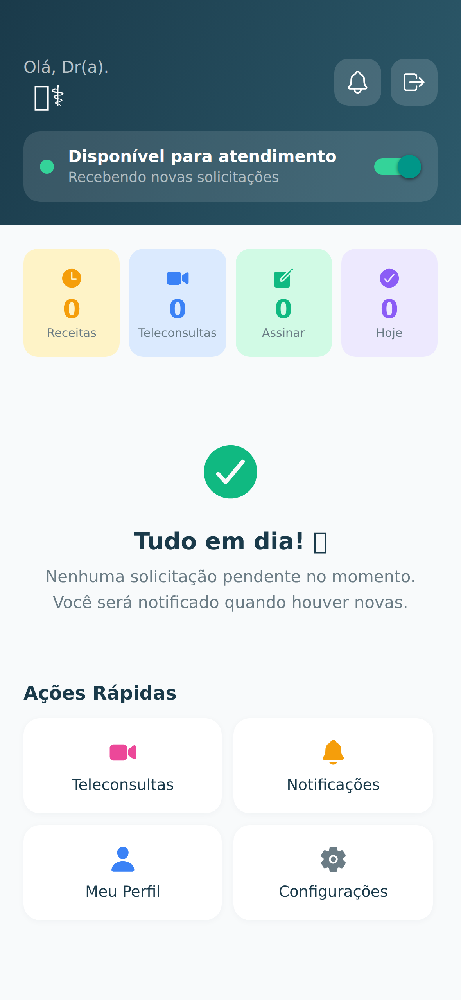
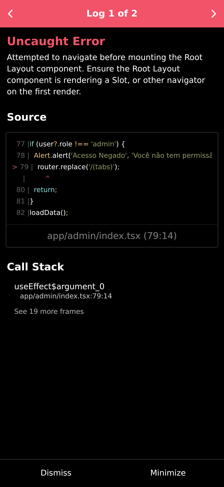

# 📸 Screenshots - RenoveJá+ App

## 🎨 Galeria Completa do Aplicativo

### 📱 25 Telas Documentadas

Navegue pelas pastas para ver todas as screenshots organizadas:

---

## 📂 Estrutura

```
screenshots/
├── 01-auth/              (4 telas)  - Autenticação
├── 02-legal/             (3 telas)  - Termos legais
├── 03-paciente/          (4 telas)  - Dashboard paciente
├── 04-receitas/          (4 telas)  - Fluxo de receitas
├── 05-exames/            (1 tela)   - Pedidos de exame
├── 06-teleconsulta/      (1 tela)   - Agendamento consulta
├── 07-medico/            (2 telas)  - Dashboard médico
├── 08-enfermeiro/        (1 tela)   - Dashboard enfermeiro
├── 09-admin/             (3 telas)  - Painel administrativo
└── 10-outros/            (2 telas)  - Config + Farmácias
```

---

## 🎯 Destaques

### 🏠 Home/Dashboard


### 💊 Solicitar Receita


### 👨‍⚕️ Painel Médico


### 🔐 Admin Dashboard


---

## 📊 Por Categoria

| Categoria | Telas | Arquivos |
|-----------|-------|----------|
| Autenticação | 4 | 01-04 |
| Legal | 3 | 05-07 |
| Paciente | 4 | 08-11 |
| Receitas | 4 | 12-15 |
| Exames | 1 | 16 |
| Teleconsulta | 1 | 17 |
| Configurações | 1 | 18 |
| Farmácias | 1 | 19 |
| Médico | 2 | 20-21 |
| Enfermeiro | 1 | 22 |
| Admin | 3 | 23-25 |

---

## 🎨 Design

**Paleta de Cores:**
- Primary: #00B4CD (Azul Turquesa)
- Secondary: #1A3A4A (Navy)
- Background: #F8FAFB (Cinza Claro)

**Features:**
- ✅ Dark Mode suportado
- ✅ Design moderno e minimalista
- ✅ Componentes reutilizáveis
- ✅ Animações suaves

---

## 📖 Documentação Completa

Veja a galeria completa em: [GALERIA-COMPLETA.md](../../GALERIA-COMPLETA.md)

Telas pendentes: [SCREENSHOTS-PENDENTES.md](../../SCREENSHOTS-PENDENTES.md)

---

**Total de Screenshots:** 25 telas  
**Última Atualização:** Janeiro 2025
